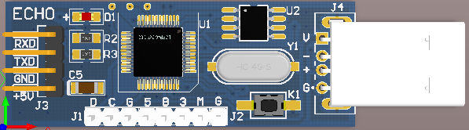
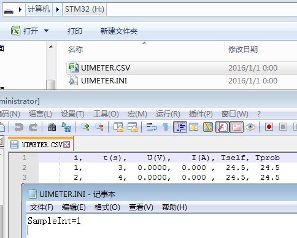

# UIDisk 用户手册

UIMeter本身自带4096点离线存储，采样周期最长可设置254秒，可以支持长达12天数据
记录。由于记录长度固定4096点，随着采样频率提高，记录时间随之下降，设置采样周
期1秒时记录时间1小时8分钟，3Hz采样时记录长度约23分钟。

离线记录可以满足大多数用户的需求，如果用户希望记录更多的数据，可以采用PC联机
在线记录，记录长度没有上限。然而某些场合如移动车辆上，密封环境中，无法使用PC
联机，此时可以考虑使用UIDisk数据采集模块。

UIDisk内置32位ARM处理器和16MB NOR闪存，自带USB接口，连接电脑可以当作U盘使用，
访问U盘中的文件。通过UIDisk的TTL串口连接UIMeter，点击按键可以启动采集，将数据
记录到U盘，记录过程无需连接PC。

4096条离线记录占用约193kB存储空间，16MB理论上可以记录超过33万条数据。

UIDisk外观与接口如下：

## 使用方法

UIDisk启动以后会检测是否安装APP：

- 如未安装APP，自动进入U盘模式，可以作为普通U盘使用，也可以安装、擦除APP。
- 如果已经安装APP，自动运行APP，其功能由APP来定义。默认安装数据采集APP。
 

记录完毕按住按键将UIDisk连接电脑，UIDisk不会运行APP，停留在U盘模式，如图 2所示。
其中UIMETER.CSV为记录数据，UIMETER.INI为设置文件，可以设置采样周期，默认1秒。

###	U盘模式

#### 安装APP

进入U盘模式，将hex文件拷贝到U盘中，文件名修改为update.hex。长按按键1秒以上，
松开按键，LED闪烁一段时间后熄灭。APP安装完毕，拔下UIDisk以后重新上电。

#### 擦除APP

进入U盘模式，新建一个空白文本文件（大小为0），修改文件名为update.hex。长按按键
1秒以上，松开按键，LED直接熄灭。APP擦除完毕，拔下UIDisk以后重新上电。

###	APP模式

#### UIMeter数据采集

首先确保正常安装数据采集APP。使用杜邦线连接UIDisk和UIMeter的TTL接口，注意TXD和
RXD需要交叉。数据采集过程中，可以将UIDisk连接移动电源，同时通过杜邦线给UIMeter供电。
开始采集之前，LED保持熄灭。短按一下按键，UIDisk按照设定的采样周期开始采集数据，
采样一次LED闪烁一下。通过观察LED闪烁频率可以判断采样是否进行中。采集过程中短按
一下按键，采集过程结束，LED熄灭，此时可以断电并导出数据。

**注意**：每次启动采集会覆盖上一次采样结果，用户应及时导出数据。采集过程如果不
停止采集直接断电可能导致数据丢失，用户应先短按按键结束采集然后断电导出数据。

## 附录

###	TTL接口

TTL四个插针依次为：RXD、TXD、GND、VCC。分别为串口接收、串口发送、地、5V电源。
接口电平为3.3V TTL，兼容5V，参考PCB丝印。

###	技术指标

| 指标            | 说明       | 备注                  |
|:---------------:|:----------:|:---------------------:|
| USB供电范围     | 4.5V-5.5V  |                       |
| U盘存储容量     | 16MB       |格式化以后容量略微减少 |
| U盘持续读取速度 | 约700kB/s  |                       |
| U盘持续写入速度 | 约37kB/s   |                       |
| U盘模式功耗     | 约32mA     |                       |
| TTL供电范围     | 4.5V-5.5V  |                       |
| TTL波特率       | 115200bps  |                       |
| 尺寸            | 50x18mm    | 不包括USB插头         |
| 重量            | 约6.6g     | 含外壳                |

