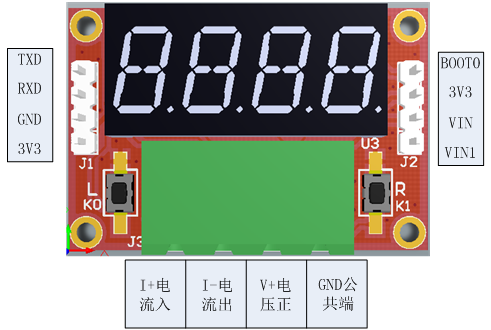
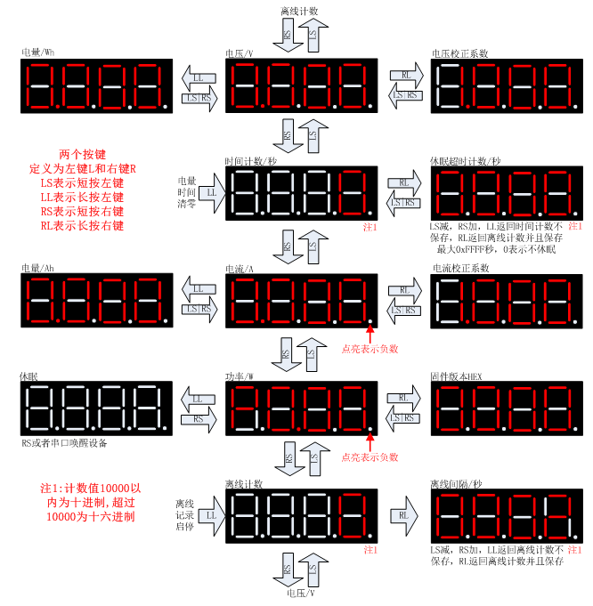
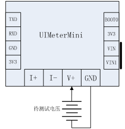
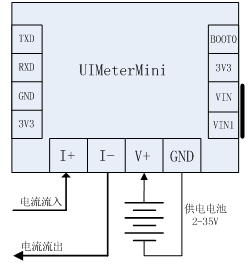
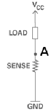
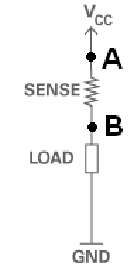
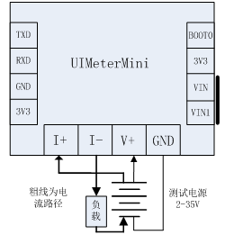
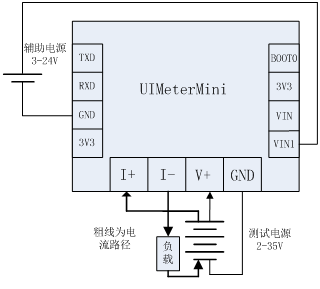

# UIMeterMini用户手册

UIMeterMini为UIMeter的精简版本，继承了UIMeter强大的电压电流监控记录功能，
体积大大缩小，简化了供电，降低了使用难度，新增四线测量等实用功能。

主要特性如下：
1. 体积小巧，不含插头仅仅40x27x15mm
2. 测量范围宽，电压高达35V，电流正负10A
3. 功耗低，典型工作功耗6.5mA，典型休眠功耗170uA，可长期连电池工作
4. 支持4096条离线数据记录与导出
5. 独特的串口命令行界面，可以查看设置各种参数
6. 电流支持高端、低端测量，检流电阻共模电压高达26V，支持真四线测量
7. 可外接蓝牙模块，支持无线联机
8. 电压电流全软件校准，提供校准命令

UIMeterMini外观与接口如下：
 

## 端口定义

### J1 TTL通信接口
四个插针从上往下依次为：TXD、RXD、GND、3V3。分别为：串口发送、串口接收、地、3.3V电源。

测量端取电时，3.3V可以对外输出电源，用于蓝牙模块等外接设备的供电。

连接USB转TTL串口数据线时，3.3V可以输入电源，注意3.3V电源只能连接3.3V电源，
**禁止连接5V电源**，会烧坏设备。

**如果只有5V USBTTL线，可以外部供电时可以将USBTTL的供电线连接到VIN1**。

### J2功能选择跳线
四个插针从上往下依次为：BOOT0、3V3、VIN、VIN1。

BOOT0为MCU引导跳线，3V3为控制板3.3V电源输出，短接BOOT0和3V3可以通过J1刷入固件，
默认状态为断开。v17.8.5版本固件以后内置了xboot，更新APP无需使用引导跳线。

VIN为测量电压，VIN1为辅助供电输入，短接VIN和VIN1设备辅助供电从测量端取电，

默认状态为短接。断开以后，可以使用USBTTL线供电，接J1的TXD、RXD、GND和J2的VIN1，

注意3.3V以上供电只能接入VIN1。

### J3 4PIN5.08测量端口
从左往右依次为：I+、I-、V+、GND。

I+和I-为电流测量端子，电流从I+流入，I-流出定义为正，反之为负。I+和I-之间连接5mR
电流取样电阻，严禁连接电压源，会造成短路。I+和I-端子电压近似相等，相对于GND的
电压定义为共模电压，共模电压范围-0.3V~26V，因此使用高端电流取样时电压不应该超过26V。

V+和GND为电压测试端子，V+电压范围2V-35V，使用高端电流取样时，电压应低于26V。
**V+与GND有极性，严禁反接，反接会烧坏设备**。

## 用户界面
UIMeterMini的用户界面由四位数码管和两个按键组成。用户界面如下：
 

### 恢复出厂设置
同时按住左键+右键上电，设备恢复出厂设置，参数保存到内置存储。
恢复出厂设置以后需要重新校准。

### 恢复默认串口波特率
按住左键上电，设备使用默认波特率115200，用于忘记波特率时联机，默认波特率不保存。

## 串口命令
UIMeter内置一个命令解释器，可以通过超级终端（或者Putty、SecrueCRT）等软件来连接。
连接以后可以设置设备参数，访问或者导出离线记录数据。

详细用法请参考《[UIMeterMini命令行手册](CmdRef.md)》。

## 常见测量场景

### 单电压测量
使用两条导线，连接图 1中J3端子的V+和GND两位到待测试电压即可。如下所示：

测试时J2端子的VIN和VIN1网络短接，UIMeterMini从待测试电源供电，电流小于10mA。
 
可以用该方式测试电池电压、直流电源输出电压。

直连电池测试电压时，如果需要长期连接电池，一定打开设备自动休眠功能，否则可能
会很快将电池电量用光。接线时一定看清楚极性，严禁接反，接反会烧。一定分清楚
电压档和电流档，用电流档测试电压会造成短路，可能带来危险。

### 单电流测量
将电路原回路断开，电流从J3的I+流入，I-流出，同时V+和GND连接电池供电，如图 4所示，

可以进行单电流测量，此时设备显示电流为待测回路电流，电压为供电电池电压，
两者没有内在联系，因此功率参数无意义。

如果电流从I-流入，I+流出，电流为负值，最后一个小数点点亮，表示负数。
 
### 电压电流测量
同时使用电压电流档，可以测试电源电压、电流、功率等参数。
电流测量分高端取样和低端取样，UIMeterMini同时支持高端取样和低端取样。
电流低端取样和高端取样原理图如下所示：

低端取样测量A点与GND之间的电压，低端取样简单方便，但会带来地平面噪声。

高端取样测量AB之间的差模电压，高端取样直接连电源，共模电压高，但是不会带来额外的接地干扰。
 
#### 电流低端取样
电流低端取样接线图如下：

电流从电源正极出来，先经过负载，然后进入UIMeterMini的J3端子I+，经过检流电阻
以后从I-出来，回到电源负极。电流路径需要用粗线连接，确保低阻抗，电压测量可
使用单独的细线连接。

采用低端取样，I+和I-端子共模电压近似为0，电源电压可以达到最大35V。
去掉VIN和VIN1之间的跳线，通过J1单独供电3.3V，电压测试线无电流流过，可实现真四线测量。
 

#### 电流高端取样
电流高端取样接线图如下：。

电流从电源正极出来，先进入UIMeterMini的J3端子I+，经过UIMeterMini内部检流电阻
以后从I-出来，经过负载，最后回到电源负极。电流路径需要用粗线连接，确保低阻抗，电压测量可
使用单独的细线连接。

采用高端取样，I+和I-端子共模电压近似为电源电压，由于I+和I-最高共模电压
不能超过26V，因此采用电流高端取样，电源电压最大26V。

去掉VIN和VIN1之间的跳线，通过J1单独供电3.3V，电压测试线无电流流过，可实现真四线测量。
 
### 辅助电源接法
如果测量2V以下或者26V以上35V以下电压，设备需要提供单独的辅助电源，测量接线如下：

常见的辅助电源为USBTTL线，VCC和GND接入UIMeterMini的GND和VIN1，如果需要联机可以同时连接TXD和RXD。

J1和J2的3V3端子都是3.3V电源，严禁连接外部3.3V以上电压。
 

## 固件更新
v17.8.5及以后固件支持TTL串口直接更新。

使用超级终端连接TTL串口以后，执行reboot 900命令，延时900ms重启，然后马上按住
键盘上的字母‘e’，设备重启进入xboot状态，执行ymodem命令，然后选择要升级的
固件，协议选择‘ymodem’等待固件下载完毕即可。

升级过程与UIMeter V2.0完全相同，可以参考相关视频。

## 技术指标
表 1 技术指标

| 指标                | 说明           | 备注                     |
|:-------------------:|:--------------:|:------------------------:|
| 电压测量范围        | 2V-35V         | 测量端直接取电           |
| 电流测量范围        | -9.999A~9.999A | 可支持高端、低端电流测量 |
| 电压分辨率          | 1mV            |                          | 
| 电流分辨率          | 1mA            |                          |
| 检流电阻            | 5mR	功率限制1W |                          |
| 检流电阻共模电压范围| -0.3V~26V      | I+和I-两个端子对GND的电压|
| 电压档输入阻抗      | 1MR            |                          |
| 采样频率            | 4Hz            |                          |
| 典型工作电流        | 6.5mA          | 5V电压、普通亮度         |
| 典型休眠电流        | 170uA          | 5V电压、普通亮度         |
| 体积                | 40x27x15mm     | 不含插头                 |
| 重量                | 15g            | 不含插头                 |

注：**超过最大范围可能损坏设备**。

