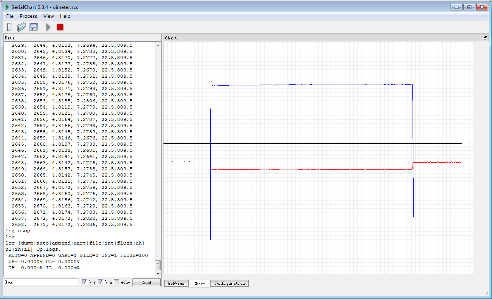
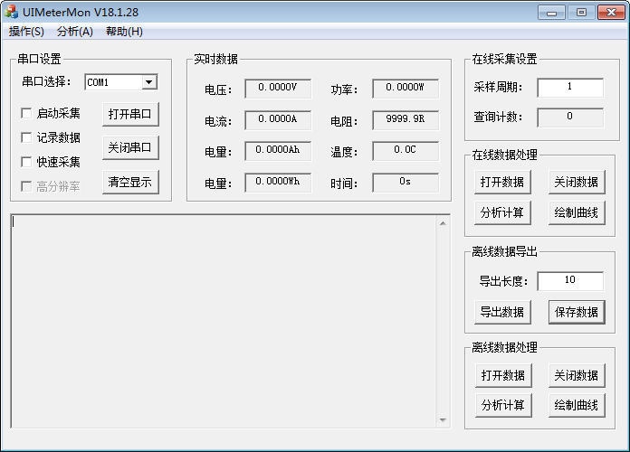
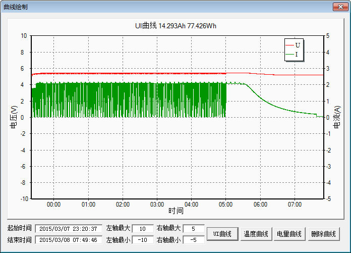
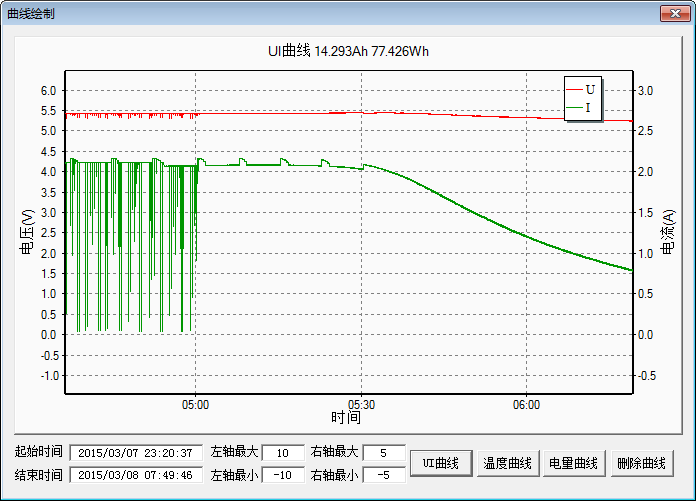
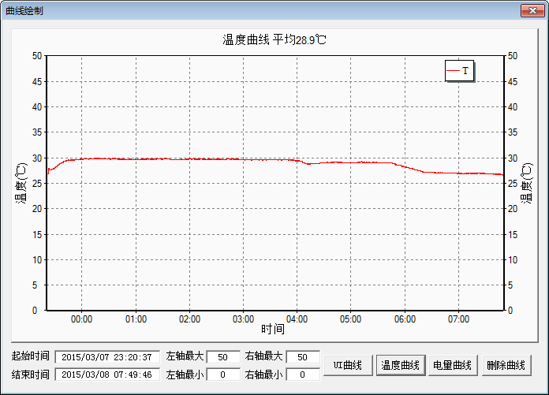
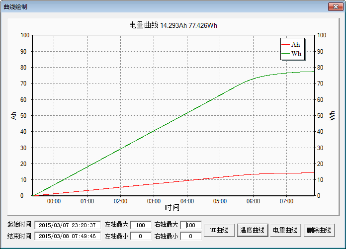

# UIMeterMon操作说明

[UIMeterMon发布日志](ReleaseNotes.md)

UIMeter目前支持二种通信协议：
1. TERM协议可以通过超级终端串口直接控制UIMeter。
2. MOSBUS协议为工业标准，可以使用组态软件编写监控工具。

鉴于很多用户对使用组态软件不习惯，UIMeter作者Echo使用VC编写了UIMeter专用上位机监控
软件：UIMeterMon，简称UIMM。UIMM主要功能为：
- 数据采集：将UIMeter采集到的数据存储到CSV文件，需要使用UIMeter硬件。
- 数据处理：对采集到的CSV数据进行分析处理，并且绘图，没有UIMeter硬件也可以使用，你甚至将
  其它软件的数据导成UIMM可以识别的CSV文件进行分析处理绘图

## 在线绘图功能

UIMeterMon仅支持在线数据采集，离线绘图，如果用户需要在线绘图，可以使用[SerialChart](http://www.starlino.com/serialchart)软件。

SerialChart配置文件：[uimeter.scc](uimeter.scc)，下载软件以后，运行SerialChart软件，按以下步骤操作：

1. 打开配置文件，并修改配置文件中的串口号。
2. 使用`log FILE 0`命令关闭记录数据文件写入。
3. 使用`log UART 1`命令打开记录数据串口发送。
4. 使用`log start`命令打开数据UIMeter数据记录功能，记录数据发往串口。
5. 测试完成可以使用`log stop`命令关闭UIMeter数据记录功能。

SerialChart显示的量程、颜色、项目都可以在配置文件中设置，根据实际需要修改即可。

## 数据采集界面

数据采集界面如下所示：

串口设置部分设置实际连接UIMeter的串口号，运行前先“打开串口”，然后勾上
“启动采集”，“实时数据”开始更新数据，勾上“记录数据”，可以把实时数据记录到CSV文件。

启动采集之前，勾上”快速采集”选项，UIMM将会以3Hz频率采样。

## 数据表现界面

使用UIMM打开CSV数据，点击“绘制曲线”按钮，可以绘制电压电流曲线：

使用鼠标可以对曲线进行局部放大：

同样可以查看温度曲线：

电量曲线：

## 操作视频

[UIMeterMon操作演示](http://v.youku.com/v_show/id_XODc2Nzc5NDI4.html?firsttime=72)

[红米5Plus充电数据分析](video/红米5Plus充电数据分析.wmv)

## 更多信息

[修订历史](ReleaseNotes.md)

[作者博客](http://blog.sina.com.cn/xjtuecho)

[作者微博](http://weibo.com/eth0)