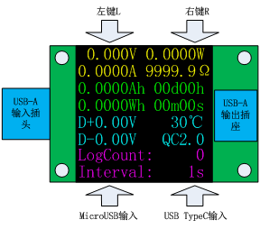
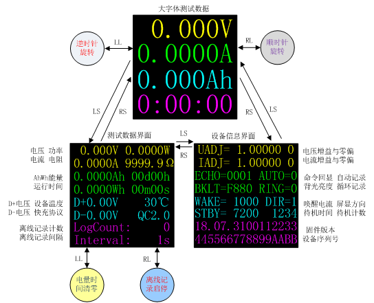
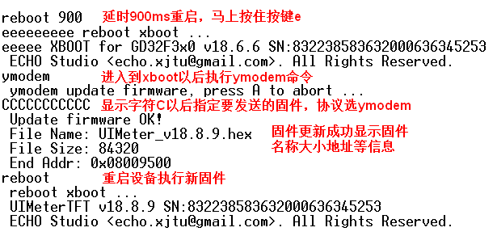

# UIMeterTFT 用户手册

## 功能概述

UIMeterTFT是一款电压电流检测仪表。主要特性如下：

- 小巧便携，亚克力外壳晶莹剔透，美观大方。
- 宽使用范围：电压3V至24V，电流-3A至3A。
- 高精度采样：电压1mV分辨率，电流0.1mA分辨率，18位ADC采样。
- 高精度电量显示：提供Ah和Wh两种电量显示，分辨率0.1mAh、0.1mWh。
- 1.44寸彩色显示屏，显示方向任意旋转。
- 简单友好的用户界面：主界面菜单只有3屏，1分钟轻松掌握。
- 具备自动休眠与唤醒功能，可长期插充电器输出使用。
- 具备USB数据线电压采集和快充协议识别功能。
- 数据离线记录功能：支持4096条离线数据记录，采样间隔可设。
- 独特的串口命令行界面：可以查看设置各种参数。
- 电压电流全软件校准，提供校准命令。
- 支持固件升级，固件持续更新。

UIMeterTFT外观与接口如下：

## 用户界面

UIMeterTFT的用户界面由1.44寸TFT彩色显示屏和两个按键组成。

LS表示短按左键；LL表示长按左键；RS表示短按右键；RL表示长按右键。

上电默认进入测试数据界面，可查看全部测试数据。长按左键清零电量和时间；长按右键开始离线记录数据。

短按右键进入大字体测试界面，在大字体界面下长按右键顺时针旋转屏幕；长按左键逆时针旋转屏幕。

再次短按右键进入设备信息界面，可以查看设备的参数、固件版本、序列号等设备信息。

| 参数项| 说明             | 修改方法         | 备注                    |
|:-----:|:----------------:|:----------------:|:-----------------------:|
| UADJ  | 电压增益与零偏   | uset命令         |                         |
| IADJ  | 电流增益与零偏   | iset命令         |                         |
| ECHO  | 串口命令是否回显 | ctrl命令         | 取值0或1                |
| AUTO  | 是否自动记录数据 | log命令          | 取值0或1                |
| BKLT  | 背光亮度         | ctrl命令         | 0x00最亮0xFF最暗        |
| WAKE  | 待机唤醒电流     | ctrl命令         | 1000表示0.1A            |
| DIR   | 屏幕显示方向     | 按键或ctrl命令   | 四个方向取值0 1 2 3     |
| STBY  | 自动待机时间     | ctrl命令         | 0或65535关闭自动待机功能|

## 串口命令

UIMeterTFT自身带有标准UART接口，用于执行串口命令，通过2.54x4排针和USB3.0插座引出。

USBTTL是专门为UIMeterUSB和UIMeterTFT配套开发的USB转TTL串口工具。使用USBTTL模块蓝色
3.0公头连接UIMeterTFT蓝色USB母头，通过USBTTL连接电脑，可以访问UIMeterTFT串口命令
解释器，可以进行参数设置，离线数据导出等操作。

UIMeterTFT支持的全部串口命令请参考《[UIMeterTFT命令行手册](UIMeterTFT_CmdRef.md)》。

## 固件更新

使用超级终端连接串口命令行以后，执行reboot 900命令，延时900ms重启，然后马上按住
键盘上的字母‘e’，设备重启进入xboot状态，执行ymodem命令，自动擦除原固件，然后
选择要升级的固件，协议选择‘ymodem’等待固件下载完毕即可。

升级过程与UIMeter V2.0/V3.0完全相同，也可参考相关视频。

[固件更新日志](FW/ReleaseNotes.md)

注：**执行ymodem命令会自动擦除固件，如果没有写入新固件导致设备无响应，重新执行ymodem命令写入固件即可**。

## 技术指标

| 指标            | 说明       | 备注             |
|:---------------:|:----------:|:----------------:|
| 电压测量范围    | 3V-24V     | 测量端直接取电   |
| 电流测量范围    | -3A~3A     |                  |
| 电压分辨率      | 1mV        |                  |
| 电流分辨率      | 0.1mA      |                  |
| 检流电阻        | 12mR       | 高分辨率版本2.2R |
| 电压测量输入阻抗| 33kR       |                  |
| 采样频率        | 3Hz        |                  |
| 记录条数        | 4096       |                  |
| 典型工作电流    | 18mA       | 5V电压、中等亮度 |
| 体积            | 59x30x13mm | 不含突出插头     |
| 重量            | 22.5g      | 含外壳           |

注：**超过最大范围可能损坏设备**。
