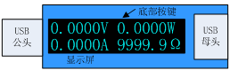
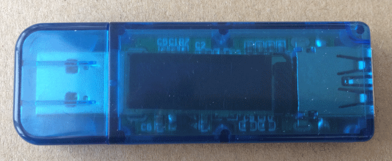
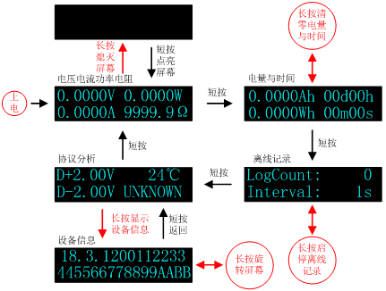
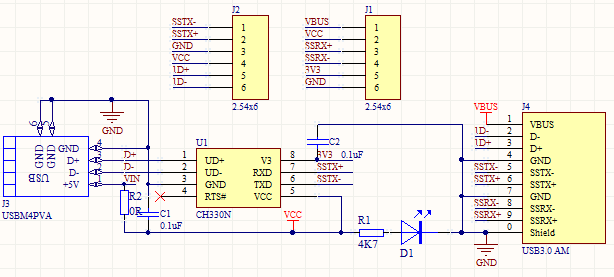
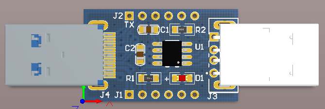
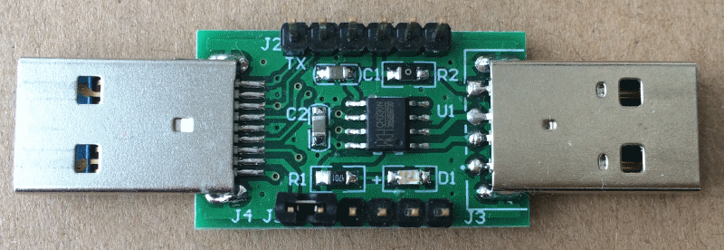
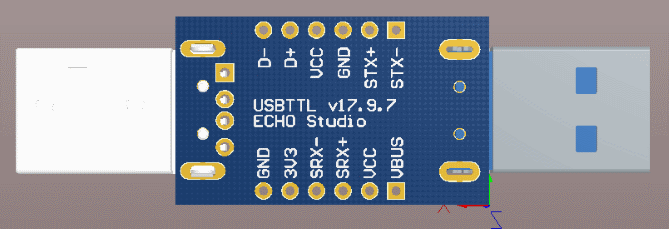
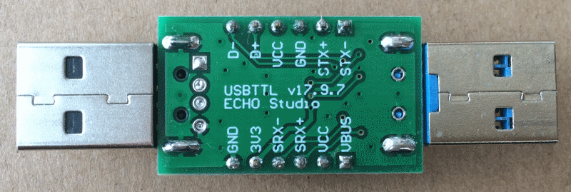

# UIMeterUSB 用户手册

## 功能概述

UIMeterUSB是一款电压电流检测仪表，继承了UIMeter强大的电压电流监控记录功能，
体积大大缩小，同时降低了使用难度，配备了透明塑料外壳，对内部电路提供保护。
主要特性如下：

- 小巧便携：U盘一般大小，轻松放进裤兜，无累赘。
- 透明塑料外壳：防护性能远好于PCB框架结构。
- 宽使用范围：电压3V至24V，电流-3A至3A。
- 高精度采样：电压0.1mV分辨率，电流0.1mA分辨率，双18位ADC采样。
- 高精度时钟：外部20ppm独立晶振，最长100天累计时间显示。
- 高精度电量显示：提供Ah和Wh两种电量显示，分辨率0.1mAh、0.1mWh。
- 简单友好的用户界面：主界面菜单只有4屏，1分钟轻松掌握。
- D+D-电压显示与快充协议识别。
- 主板温度显示。
- 低功耗：典型功耗6.5mA，普通亮度，关闭屏幕功耗更低。
- 低内阻：典型值38mR。
- 数据离线记录功能：支持4096条离线数据记录，采样间隔可设。
- 独特的串口命令行界面：可以查看设置各种参数，支持IAP固件升级。
- 电压电流全软件校准，提供校准命令。

UIMeterUSB外观与接口如下：

## 用户界面

UIMeterUSB的用户界面由OLED显示屏和一个按键组成。用户界面如下：

## 串口命令

USBTTL是专门为UIMeterUSB配套开发的USB转串口模块，原理图和外观如下：

使用USBTTL模块蓝色3.0公头连接UIMeterUSB蓝色USB母头，通过USBTTL连接电脑，
可以访问UIMeterUSB串口命令解释器，可以进行参数设置，离线数据导出等操作。

UIMeterUSB支持的全部串口命令请参考《[UIMeterUSB命令行手册](CmdRef.md)》。

## 固件更新

使用超级终端连接串口命令行以后，执行reboot 900命令，延时900ms重启，然后马上
按住键盘上的字母`e`，设备重启进入xboot状态，执行ymodem命令，然后选择要升级的
固件，协议选择`ymodem`等待固件下载完毕即可。

升级过程与UIMeter V2.0完全相同，可参考相关视频。

[固件更新日志](FW/ReleaseNotes.md)

## 技术指标

| 指标           | 说明       | 备注             |
|:--------------:|:----------:|:----------------:|
| 电压测量范围   | 3V-24V     | 测量端直接取电   |
| 电流测量范围   | -3A~3A     |                  |
| 电压分辨率     | 0.1mV      |                  |
| 电流分辨率     | 0.1mA      |                  |
| 检流电阻       | 12mR       |                  |
| 电压档输入阻抗 | 1MR        |                  |
| 采样频率       | 3Hz        |                  |
| 记录条数       | 4096       |                  |
| 典型工作电流   | 6.5mA      | 5V电压、普通亮度 |
| 内阻           | 38mR       | 典型值           |
| 体积           | 65x22x11mm | 含外壳           |
| 重量           | 14g        | 含外壳           |

注：**超过最大范围可能损坏设备**。
